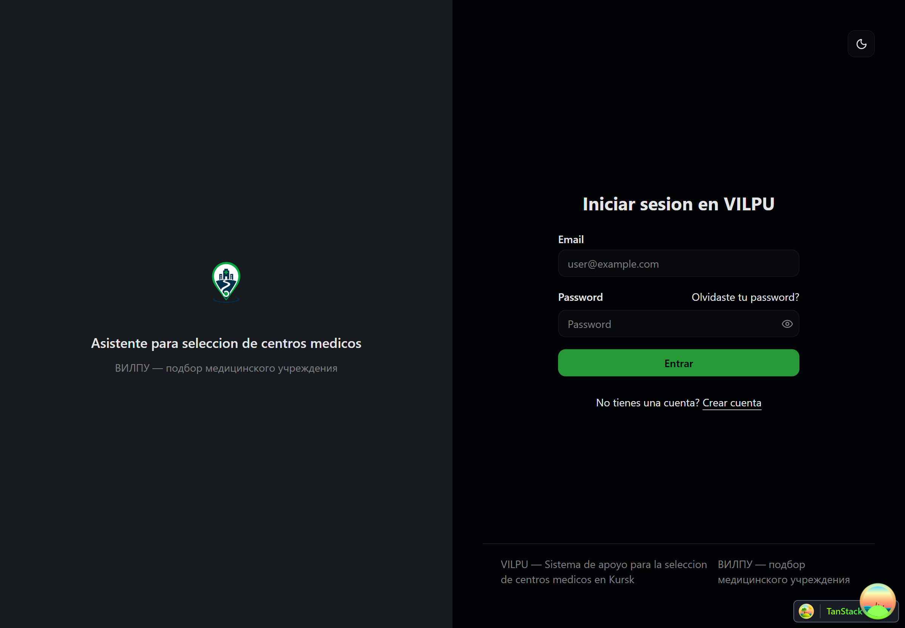
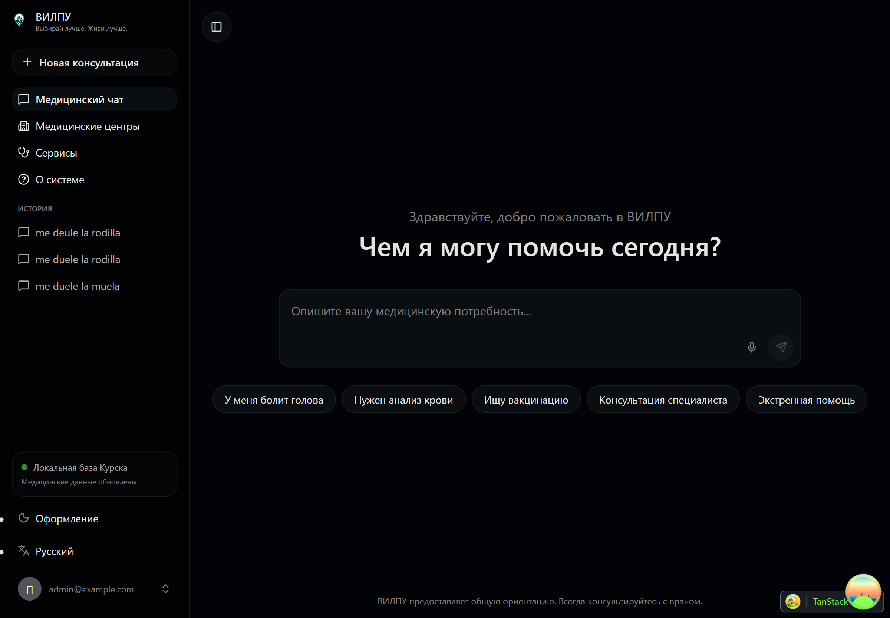

# Chatia Fullstack

Chatia Fullstack es una aplicacion web de orientacion medica inicial para la ciudad de Kursk. El sistema permite que una persona describa una necesidad de salud, responde con preguntas de triaje cuando hacen falta mas datos y recomienda el tipo de institucion medica mas adecuado junto con centros locales compatibles.

El proyecto parte de una base FastAPI + React, pero ya esta adaptado a un caso de uso propio: chatbot medico, catalogo local de instituciones, reglas de triaje, recomendaciones por riesgo, historial de conversaciones y una integracion opcional con Rasa para NLU.


Vista escritorio



Vista escritorio



## Funcionalidades principales

- Chat medico en la interfaz web VILPU.
- Identificacion de necesidades como dolor dental, dolor de rodilla, fiebre, dolor abdominal, problemas de vision, vacunacion, farmacia y urgencias.
- Preguntas de triaje con opciones y puntaje de riesgo.
- Calculo de riesgo `low`, `medium` o `high`.
- Recomendacion de servicio, especialidad y tipo de institucion.
- Listado de centros medicos locales en Kursk con direccion, horario, telefono, rating, servicios y especialidades.
- Historial de sesiones de chat por usuario autenticado.
- Catalogos medicos cargados desde datos semilla en PostgreSQL.
- Rasa opcional como capa de comprension de lenguaje natural.
- Autenticacion JWT, usuarios, recuperacion de contrasena y panel administrativo heredados de la base fullstack.

## Stack tecnico

- Backend: FastAPI, SQLModel, Pydantic, Alembic, PostgreSQL.
- Frontend: React, TypeScript, Vite, TanStack Router, TanStack Query, Tailwind CSS, shadcn/ui y lucide-react.
- Chatbot: reglas propias en FastAPI, datos medicos en PostgreSQL y Rasa opcional.
- Infraestructura local: Docker Compose, Traefik, Adminer y Mailcatcher.
- Testing: Pytest para backend y Playwright para frontend.
- Herramientas: `uv` para Python y `bun` para frontend.

## Estructura del repositorio

```text
backend/                 API FastAPI, modelos, migraciones, servicios y tests
frontend/                Aplicacion React/Vite y cliente OpenAPI generado
rasa/                    Configuracion, datos NLU, acciones y modelos Rasa
docs/                    Documentacion local y casos de validacion del chatbot
scripts/                 Scripts auxiliares de setup, test y generacion
compose.yml              Servicios base para Docker Compose
compose.override.yml     Puertos y servicios de desarrollo local
```

## Requisitos

Para desarrollo nativo en Windows:

- Python 3.10 o superior.
- `uv`.
- Bun.
- PostgreSQL.

Para desarrollo con contenedores:

- Docker Desktop con WSL2 habilitado.
- Docker Compose.

La configuracion ya preparada en esta maquina esta documentada en [docs/local_setup.md](./docs/local_setup.md).

## Variables de entorno

El proyecto usa un archivo `.env` en la raiz. Las variables mas relevantes son:

```env
PROJECT_NAME=Chatia
ENVIRONMENT=local
FRONTEND_HOST=http://localhost:5173
BACKEND_CORS_ORIGINS=http://localhost:5173

SECRET_KEY=changethis
FIRST_SUPERUSER=admin@example.com
FIRST_SUPERUSER_PASSWORD=changethis

POSTGRES_SERVER=localhost
POSTGRES_PORT=5432
POSTGRES_DB=app
POSTGRES_USER=postgres
POSTGRES_PASSWORD=changethis

YANDEX_API_KEY=
RASA_ENABLED=false
RASA_URL=http://rasa:5005
RASA_CONFIDENCE_THRESHOLD=0.55
```

Los valores `changethis` solo son aceptables en desarrollo local. Para cualquier entorno compartido o despliegue cambia `SECRET_KEY`, `POSTGRES_PASSWORD` y `FIRST_SUPERUSER_PASSWORD`.

## Arranque local nativo

Esta es la forma recomendada en la maquina donde se preparo el proyecto.

1. Abre PowerShell en la raiz del repositorio.

```powershell
cd C:\Users\Trabajo\Desktop\diploma-t\proyecto-practico\chatia-fullstack
```

2. Comprueba que PostgreSQL este activo.

```powershell
Get-Service postgresql-x64-17
```

3. Si es la primera ejecucion, inicializa la base de datos.

```powershell
cd backend
..\.venv\Scripts\python.exe -m app.backend_pre_start
..\.venv\Scripts\alembic.exe upgrade head
..\.venv\Scripts\python.exe -m app.initial_data
cd ..
```

4. Arranca el backend.

```powershell
cd backend
..\.venv\Scripts\python.exe -m uvicorn app.main:app --reload --host 127.0.0.1 --port 8000
```

5. En otra terminal, arranca el frontend.

```powershell
cd frontend
bun run dev --host 127.0.0.1 --port 5173
```

6. Abre la aplicacion.

```text
Frontend: http://localhost:5173
Backend:  http://localhost:8000
Swagger:  http://localhost:8000/docs
Health:   http://localhost:8000/api/v1/utils/health-check/
```

Usuario inicial local:

```text
Email: admin@example.com
Password: changethis
```

## Arranque con Docker Compose

Usa esta opcion cuando Docker Desktop y WSL2 esten funcionando.

```powershell
docker compose watch
```

Servicios de desarrollo:

```text
Frontend:    http://localhost:5173
Backend:     http://localhost:8001
Swagger:     http://localhost:8001/docs
Adminer:     http://localhost:8080
Mailcatcher: http://localhost:1080
Traefik:     http://localhost:8090
```

Comandos utiles:

```powershell
docker compose logs -f backend
docker compose logs -f frontend
docker compose down
docker compose down -v
```

`docker compose down -v` elimina tambien el volumen local de PostgreSQL.

## Chatbot medico

El flujo principal vive en:

- [backend/app/api/routes/chat.py](./backend/app/api/routes/chat.py)
- [backend/app/services/chatbot.py](./backend/app/services/chatbot.py)
- [frontend/src/components/Chat/ChatInterface.tsx](./frontend/src/components/Chat/ChatInterface.tsx)

Endpoints principales:

```text
POST /api/v1/chat
POST /api/v1/chat/answer
POST /api/v1/chat/nlu-debug
GET  /api/v1/chat/sessions
GET  /api/v1/chat/sessions/{chat_session_id}
POST /api/v1/medical-centers/search
GET  /api/v1/medical-centers/
```

Ejemplo de uso desde la interfaz:

```text
Me duele mucho una muela desde ayer y tengo la encia inflamada.
```

El sistema debe detectar la necesidad medica, pedir triaje si corresponde y devolver una orientacion con nivel de riesgo, servicio recomendado, especialidad, tipo de institucion y centros medicos compatibles.

Los casos de validacion funcional estan en [docs/chatbot_test_cases.md](./docs/chatbot_test_cases.md).

## Screenshots and project evidence

Las capturas reales del sistema funcionando y las evidencias visuales del proyecto se organizan en `docs/screenshots/`.

Consulta la guia de capturas en [Screenshots documentation](docs/screenshots/README.md).

## Datos medicos

La base medica se carga desde:

```text
backend/app/seed_data/medical_seed.json
```

Incluye:

- Tipos de institucion medica.
- Servicios.
- Especialidades.
- Necesidades de salud.
- Reglas necesidad-servicio.
- Preguntas y opciones de triaje.
- Reglas de recomendacion por puntaje.
- Centros medicos locales.

Para volver a cargar los datos semilla:

```powershell
cd backend
..\.venv\Scripts\python.exe -m app.scripts.seed_medical_data
```

## Rasa opcional

Rasa esta deshabilitado por defecto. El backend puede funcionar solo con reglas y palabras clave.

Entrena el modelo:

```powershell
docker compose run --rm rasa train
```

Habilita Rasa en `.env`:

```env
COMPOSE_PROFILES=rasa
RASA_ENABLED=true
RASA_URL=http://rasa:5005
```

Levanta el stack con el perfil:

```powershell
docker compose --profile rasa watch
```

Si Rasa no responde, falla o devuelve baja confianza, el backend usa el flujo de fallback basado en reglas.

## Comandos de desarrollo

Backend:

```powershell
cd backend
..\.venv\Scripts\ruff.exe check app tests
..\.venv\Scripts\pytest.exe tests
```

Frontend:

```powershell
cd frontend
bun run lint
bun run build
bun run test
```

Workspace frontend desde la raiz:

```powershell
bun run dev
bun run lint
bun run test
```

Regenerar cliente OpenAPI:

```powershell
cd frontend
bun run generate-client
```

## Despliegue

El despliegue sigue el enfoque Docker Compose del proyecto base. Antes de desplegar:

- Cambia todos los secretos por valores seguros.
- Configura `DOMAIN`, `FRONTEND_HOST` y `BACKEND_CORS_ORIGINS`.
- Define credenciales reales de PostgreSQL.
- Configura SMTP si se usara recuperacion de contrasena por email.
- Agrega `YANDEX_API_KEY` si se integraran busquedas externas.

Consulta [deployment.md](./deployment.md) para detalles de despliegue y Traefik.

## Documentacion relacionada

- [docs/local_setup.md](./docs/local_setup.md): configuracion local preparada en esta maquina.
- [docs/chatbot_test_cases.md](./docs/chatbot_test_cases.md): validacion funcional del chatbot medico.
- [docs/screenshots/README.md](./docs/screenshots/README.md): guia de capturas y evidencias visuales del sistema.
- [backend/README.md](./backend/README.md): notas especificas del backend.
- [frontend/README.md](./frontend/README.md): notas especificas del frontend.
- [development.md](./development.md): desarrollo general del stack.
- [deployment.md](./deployment.md): despliegue con Docker Compose.

## Licencia

Este proyecto conserva la licencia MIT incluida en [LICENSE](./LICENSE).
